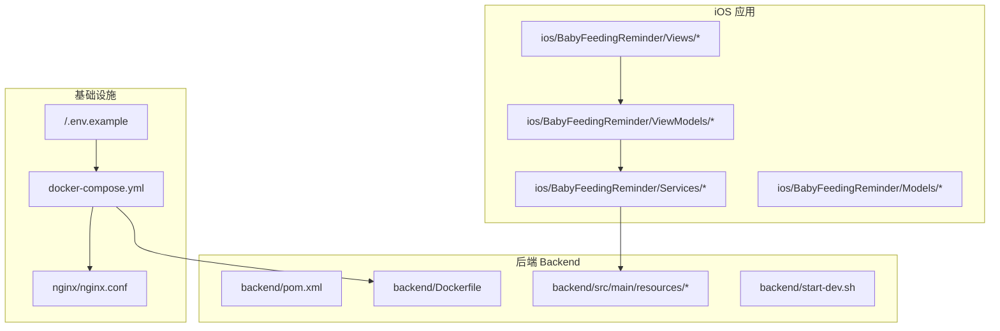
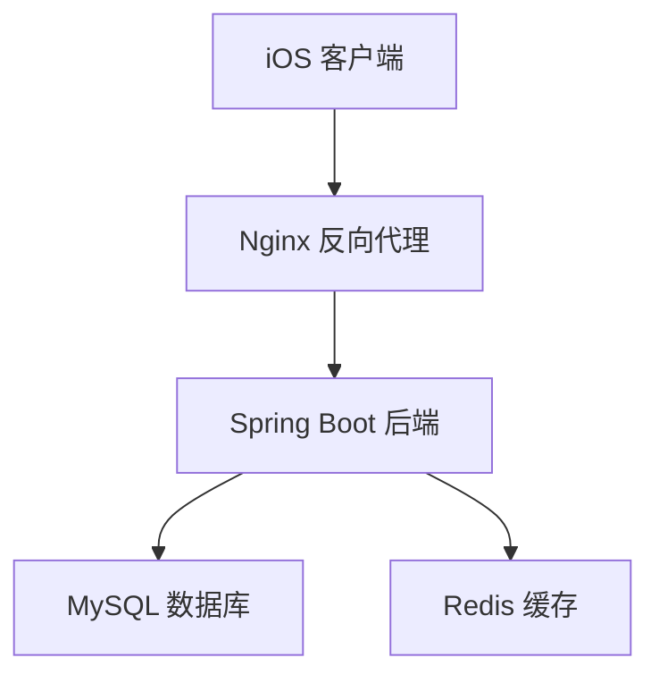
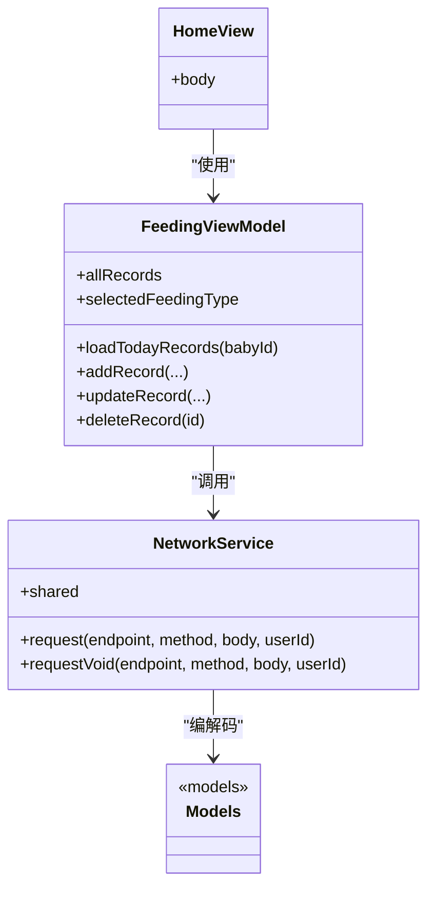
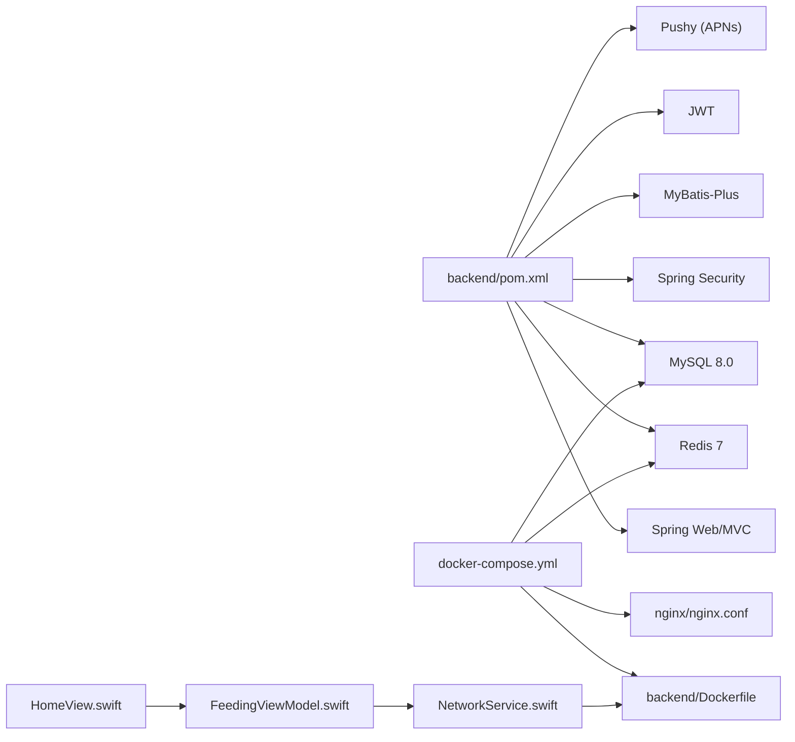

# 目录结构

<cite>
**本文引用的文件**
- [backend/pom.xml](file://backend/pom.xml)
- [backend/src/main/resources/application.yml](file://backend/src/main/resources/application.yml)
- [backend/src/main/resources/db/init.sql](file://backend/src/main/resources/db/init.sql)
- [backend/Dockerfile](file://backend/Dockerfile)
- [backend/start-dev.sh](file://backend/start-dev.sh)
- [docker-compose.yml](file://docker-compose.yml)
- [nginx/nginx.conf](file://nginx/nginx.conf)
- [.env.example](file://.env.example)
- [ios/BabyFeedingReminder/Views/HomeView.swift](file://ios/BabyFeedingReminder/Views/HomeView.swift)
- [ios/BabyFeedingReminder/ViewModels/FeedingViewModel.swift](file://ios/BabyFeedingReminder/ViewModels/FeedingViewModel.swift)
- [ios/BabyFeedingReminder/Services/NetworkService.swift](file://ios/BabyFeedingReminder/Services/NetworkService.swift)
- [ios/BabyFeedingReminder/Models/Models.swift](file://ios/BabyFeedingReminder/Models/Models.swift)
</cite>

## 目录
1. [简介](#简介)
2. [项目结构](#项目结构)
3. [核心组件](#核心组件)
4. [架构总览](#架构总览)
5. [详细组件分析](#详细组件分析)
6. [依赖关系分析](#依赖关系分析)
7. [性能考量](#性能考量)
8. [故障排查指南](#故障排查指南)
9. [结论](#结论)
10. [附录](#附录)

## 简介
本节聚焦于项目的目录结构与各模块职责，帮助开发者快速定位代码位置、理解前后端分层与容器编排方式。后端采用 Spring Boot，使用 Maven 管理依赖；iOS 采用 SwiftUI，遵循 MVVM 模式组织 Views、ViewModels、Services 与 Models；通过 docker-compose 编排后端、MySQL、Redis 与可选的 Nginx 反向代理；Nginx 配置提供 API 反向代理与健康检查端点；.env.example 提供环境变量模板；init.sql 用于初始化数据库结构与测试数据。

## 项目结构
- backend/
  - src/main/java：后端业务代码（控制器、服务、实体、映射、配置等）
  - src/main/resources：应用配置、数据库初始化脚本
  - pom.xml：Maven 依赖与构建配置
  - Dockerfile：后端镜像构建
  - start-dev.sh：开发环境一键启动脚本
- ios/
  - BabyFeedingReminder/：SwiftUI 应用主体
    - Views：UI 视图层（如 HomeView、FeedingView 等）
    - ViewModels：MVVM 的 ViewModel 层（如 FeedingViewModel）
    - Services：网络与通知服务（NetworkService、NotificationService）
    - Models：数据模型（Baby、FeedingRecord、SleepRecord、Reminder 等）
- nginx/：Nginx 反向代理配置
- .env.example：环境变量示例
- docker-compose.yml：容器编排定义
- 其他根级文件：README.md、根目录下其他说明文档

图表来源
- [backend/pom.xml](file://backend/pom.xml#L1-L135)
- [backend/src/main/resources/application.yml](file://backend/src/main/resources/application.yml#L1-L98)
- [backend/Dockerfile](file://backend/Dockerfile#L1-L38)
- [backend/start-dev.sh](file://backend/start-dev.sh#L1-L89)
- [docker-compose.yml](file://docker-compose.yml#L1-L89)
- [nginx/nginx.conf](file://nginx/nginx.conf#L1-L79)
- [.env.example](file://.env.example#L1-L13)
- [ios/BabyFeedingReminder/Views/HomeView.swift](file://ios/BabyFeedingReminder/Views/HomeView.swift#L1-L535)
- [ios/BabyFeedingReminder/ViewModels/FeedingViewModel.swift](file://ios/BabyFeedingReminder/ViewModels/FeedingViewModel.swift#L1-L226)
- [ios/BabyFeedingReminder/Services/NetworkService.swift](file://ios/BabyFeedingReminder/Services/NetworkService.swift#L1-L199)
- [ios/BabyFeedingReminder/Models/Models.swift](file://ios/BabyFeedingReminder/Models/Models.swift#L1-L196)

章节来源
- [backend/pom.xml](file://backend/pom.xml#L1-L135)
- [backend/src/main/resources/application.yml](file://backend/src/main/resources/application.yml#L1-L98)
- [backend/src/main/resources/db/init.sql](file://backend/src/main/resources/db/init.sql#L1-L147)
- [backend/Dockerfile](file://backend/Dockerfile#L1-L38)
- [backend/start-dev.sh](file://backend/start-dev.sh#L1-L89)
- [docker-compose.yml](file://docker-compose.yml#L1-L89)
- [nginx/nginx.conf](file://nginx/nginx.conf#L1-L79)
- [.env.example](file://.env.example#L1-L13)
- [ios/BabyFeedingReminder/Views/HomeView.swift](file://ios/BabyFeedingReminder/Views/HomeView.swift#L1-L535)
- [ios/BabyFeedingReminder/ViewModels/FeedingViewModel.swift](file://ios/BabyFeedingReminder/ViewModels/FeedingViewModel.swift#L1-L226)
- [ios/BabyFeedingReminder/Services/NetworkService.swift](file://ios/BabyFeedingReminder/Services/NetworkService.swift#L1-L199)
- [ios/BabyFeedingReminder/Models/Models.swift](file://ios/BabyFeedingReminder/Models/Models.swift#L1-L196)

## 核心组件
- 后端 Spring Boot（Maven 管理依赖、MyBatis-Plus、Spring Web/MVC、Security、Redis、OpenAPI/Swagger）
- iOS SwiftUI（MVVM：Views/ViewModels/Services/Models）
- 容器编排（docker-compose：后端、MySQL、Redis、可选 Nginx）
- 反向代理（Nginx：API 反向代理、健康检查）
- 开发启动（start-dev.sh：检查 Java/Maven/数据库，按 profile 启动）

章节来源
- [backend/pom.xml](file://backend/pom.xml#L1-L135)
- [backend/src/main/resources/application.yml](file://backend/src/main/resources/application.yml#L1-L98)
- [docker-compose.yml](file://docker-compose.yml#L1-L89)
- [nginx/nginx.conf](file://nginx/nginx.conf#L1-L79)
- [backend/start-dev.sh](file://backend/start-dev.sh#L1-L89)

## 架构总览
后端通过 Nginx 对外提供统一入口，转发 /api 到后端服务；后端连接 MySQL 与 Redis；iOS 应用通过 NetworkService 调用后端接口，ViewModels 负责数据聚合与状态管理，Views 负责展示与交互。

图表来源
- [nginx/nginx.conf](file://nginx/nginx.conf#L1-L79)
- [docker-compose.yml](file://docker-compose.yml#L1-L89)
- [backend/src/main/resources/application.yml](file://backend/src/main/resources/application.yml#L1-L98)

## 详细组件分析

### 后端目录与职责
- src/main/java
  - controller：API 控制器（BabyController、FeedingRecordController、ReminderController、SleepRecordController、StatisticsController）
  - service/impl：业务实现（BabyServiceImpl、FeedingRecordServiceImpl、PushServiceImpl、ReminderServiceImpl、SleepRecordServiceImpl）
  - mapper：MyBatis Mapper 接口（BabyMapper、FeedingRecordMapper、FeedingSettingMapper、ReminderMapper、SleepRecordMapper、SleepSettingMapper、UserMapper）
  - entity/dto/vo：实体、传输对象与视图对象
  - config：安全与 MyBatis Plus 配置（SecurityConfig、MyBatisPlusConfig）
  - Application：Spring Boot 启动类
- src/main/resources
  - application.yml：服务端口、数据库、Redis、MyBatis Plus、JWT、APNs、Swagger 等配置
  - db/init.sql：数据库初始化脚本（创建库与表、索引、插入测试用户）
- pom.xml：Spring Boot 3、Java 17、MyBatis-Plus、MySQL 驱动、JWT、APNs 客户端、Lombok、OpenAPI、测试依赖
- Dockerfile：多阶段构建（JDK 构建、JRE 运行），暴露 8080，设置 JAVA_OPTS
- start-dev.sh：检查 Java/Maven/数据库，按 dev profile 启动后端

章节来源
- [backend/src/main/resources/application.yml](file://backend/src/main/resources/application.yml#L1-L98)
- [backend/src/main/resources/db/init.sql](file://backend/src/main/resources/db/init.sql#L1-L147)
- [backend/pom.xml](file://backend/pom.xml#L1-L135)
- [backend/Dockerfile](file://backend/Dockerfile#L1-L38)
- [backend/start-dev.sh](file://backend/start-dev.sh#L1-L89)

### iOS 目录与 MVVM 组织
- Views：UI 视图（HomeView、FeedingView、SleepView、StatisticsView、SettingsView、BabyFormView 等）
- ViewModels：业务状态与数据聚合（FeedingViewModel、HomeViewModel、SleepViewModel、StatisticsViewModel）
- Services：
  - NetworkService：统一请求封装（Base URL、编码/解码、错误处理、userId 头）
  - NotificationService：推送相关服务
- Models：数据模型（Baby、FeedingRecord、SleepRecord、FeedingSetting、SleepSetting、Reminder）

图表来源
- [ios/BabyFeedingReminder/Services/NetworkService.swift](file://ios/BabyFeedingReminder/Services/NetworkService.swift#L1-L199)
- [ios/BabyFeedingReminder/ViewModels/FeedingViewModel.swift](file://ios/BabyFeedingReminder/ViewModels/FeedingViewModel.swift#L1-L226)
- [ios/BabyFeedingReminder/Views/HomeView.swift](file://ios/BabyFeedingReminder/Views/HomeView.swift#L1-L535)
- [ios/BabyFeedingReminder/Models/Models.swift](file://ios/BabyFeedingReminder/Models/Models.swift#L1-L196)

章节来源
- [ios/BabyFeedingReminder/Views/HomeView.swift](file://ios/BabyFeedingReminder/Views/HomeView.swift#L1-L535)
- [ios/BabyFeedingReminder/ViewModels/FeedingViewModel.swift](file://ios/BabyFeedingReminder/ViewModels/FeedingViewModel.swift#L1-L226)
- [ios/BabyFeedingReminder/Services/NetworkService.swift](file://ios/BabyFeedingReminder/Services/NetworkService.swift#L1-L199)
- [ios/BabyFeedingReminder/Models/Models.swift](file://ios/BabyFeedingReminder/Models/Models.swift#L1-L196)

### Nginx 反向代理
- upstream backend 指向后端容器 8080
- location /api 代理到 upstream
- 健康检查 /health 返回 200
- 支持 gzip、keepalive、超时设置

章节来源
- [nginx/nginx.conf](file://nginx/nginx.conf#L1-L79)
- [docker-compose.yml](file://docker-compose.yml#L1-L89)

### 环境变量与容器编排
- .env.example：数据库密码、JWT 密钥、APNs 配置占位
- docker-compose.yml：
  - backend：构建 Dockerfile，端口映射 8080，依赖 mysql/redis，健康检查
  - mysql：8.0，字符集 utf8mb4，挂载 init.sql，持久化卷
  - redis：7-alpine，持久化卷
  - nginx：可选生产环境，挂载 nginx.conf 与 SSL

章节来源
- [.env.example](file://.env.example#L1-L13)
- [docker-compose.yml](file://docker-compose.yml#L1-L89)

### 数据库初始化与开发启动
- init.sql：创建数据库与表、索引、插入测试用户
- start-dev.sh：校验 Java/Maven，可选择使用 docker-compose 启动数据库，再以 dev profile 启动后端

章节来源
- [backend/src/main/resources/db/init.sql](file://backend/src/main/resources/db/init.sql#L1-L147)
- [backend/start-dev.sh](file://backend/start-dev.sh#L1-L89)

## 依赖关系分析
- 后端依赖
  - Spring Boot Web、Validation、Security、Data Redis、MyBatis-Plus、MySQL 驱动、JWT、APNs 客户端、Lombok、OpenAPI、测试框架
- iOS 依赖
  - SwiftUI（系统框架）、自定义 NetworkService（基于 URLSession）
- 容器依赖
  - backend 依赖 mysql 与 redis，nginx 依赖 backend

图表来源
- [backend/pom.xml](file://backend/pom.xml#L1-L135)
- [docker-compose.yml](file://docker-compose.yml#L1-L89)
- [nginx/nginx.conf](file://nginx/nginx.conf#L1-L79)
- [ios/BabyFeedingReminder/Services/NetworkService.swift](file://ios/BabyFeedingReminder/Services/NetworkService.swift#L1-L199)
- [ios/BabyFeedingReminder/Views/HomeView.swift](file://ios/BabyFeedingReminder/Views/HomeView.swift#L1-L535)
- [ios/BabyFeedingReminder/ViewModels/FeedingViewModel.swift](file://ios/BabyFeedingReminder/ViewModels/FeedingViewModel.swift#L1-L226)

## 性能考量
- 后端镜像使用 G1GC、限制堆大小，适合容器运行
- Nginx 启用 gzip、keepalive、超时控制，提升静态资源与长连接性能
- MySQL 字符集与 collation 设为 utf8mb4，减少字符集转换开销
- Redis 作为缓存，降低数据库压力

章节来源
- [backend/Dockerfile](file://backend/Dockerfile#L1-L38)
- [nginx/nginx.conf](file://nginx/nginx.conf#L1-L79)
- [docker-compose.yml](file://docker-compose.yml#L1-L89)

## 故障排查指南
- 启动后端失败
  - 检查 Java 与 Maven 是否满足要求，使用 start-dev.sh 自动检测
  - 若使用 Docker，确认 docker-compose 启动了 mysql 与 redis，并处于健康状态
- 数据库连接问题
  - application.yml 中的数据库 URL、用户名、密码与 docker-compose 环境变量一致
  - init.sql 是否正确挂载并执行
- iOS 请求失败
  - NetworkService 的 baseURL 与后端 /api 路径一致
  - 检查后端返回的 API 包装结构与错误码
- Nginx 代理异常
  - 确认 location /api 正确代理到 backend:8080
  - /health 响应是否 200

章节来源
- [backend/start-dev.sh](file://backend/start-dev.sh#L1-L89)
- [backend/src/main/resources/application.yml](file://backend/src/main/resources/application.yml#L1-L98)
- [docker-compose.yml](file://docker-compose.yml#L1-L89)
- [nginx/nginx.conf](file://nginx/nginx.conf#L1-L79)
- [ios/BabyFeedingReminder/Services/NetworkService.swift](file://ios/BabyFeedingReminder/Services/NetworkService.swift#L1-L199)

## 结论
本项目采用清晰的前后端分离与容器化架构：后端以 Spring Boot 为核心，iOS 以 SwiftUI 实现 MVVM，docker-compose 统一编排，Nginx 提供反向代理与健康检查。开发者可通过目录结构快速定位控制器、视图、服务与模型，结合 start-dev.sh 与 docker-compose 快速搭建开发环境。

## 附录

### 实用导航指南（开发者）
- 定位 API 端点
  - 后端控制器位于 backend/src/main/java/com/baby/controller 下，按功能命名（如 FeedingRecordController、SleepRecordController）
  - Swagger 文档路径在 application.yml 中配置，访问 /swagger-ui.html 或 /v3/api-docs
- 查找 UI 组件
  - iOS 视图位于 ios/BabyFeedingReminder/Views，如 HomeView、FeedingView、SleepView、StatisticsView
  - 对应 ViewModel 在 ios/BabyFeedingReminder/ViewModels
  - 网络请求封装在 ios/BabyFeedingReminder/Services/NetworkService.swift
  - 数据模型在 ios/BabyFeedingReminder/Models/Models.swift
- 容器与部署
  - 使用 docker-compose 启动后端、MySQL、Redis、可选 Nginx
  - 生产环境可启用 Nginx 并挂载证书目录
- 初始化数据库
  - init.sql 由 docker-compose 挂载到 MySQL 初始化目录，自动创建库与表并插入测试用户

章节来源
- [backend/src/main/resources/application.yml](file://backend/src/main/resources/application.yml#L1-L98)
- [backend/src/main/resources/db/init.sql](file://backend/src/main/resources/db/init.sql#L1-L147)
- [docker-compose.yml](file://docker-compose.yml#L1-L89)
- [ios/BabyFeedingReminder/Views/HomeView.swift](file://ios/BabyFeedingReminder/Views/HomeView.swift#L1-L535)
- [ios/BabyFeedingReminder/ViewModels/FeedingViewModel.swift](file://ios/BabyFeedingReminder/ViewModels/FeedingViewModel.swift#L1-L226)
- [ios/BabyFeedingReminder/Services/NetworkService.swift](file://ios/BabyFeedingReminder/Services/NetworkService.swift#L1-L199)
- [ios/BabyFeedingReminder/Models/Models.swift](file://ios/BabyFeedingReminder/Models/Models.swift#L1-L196)