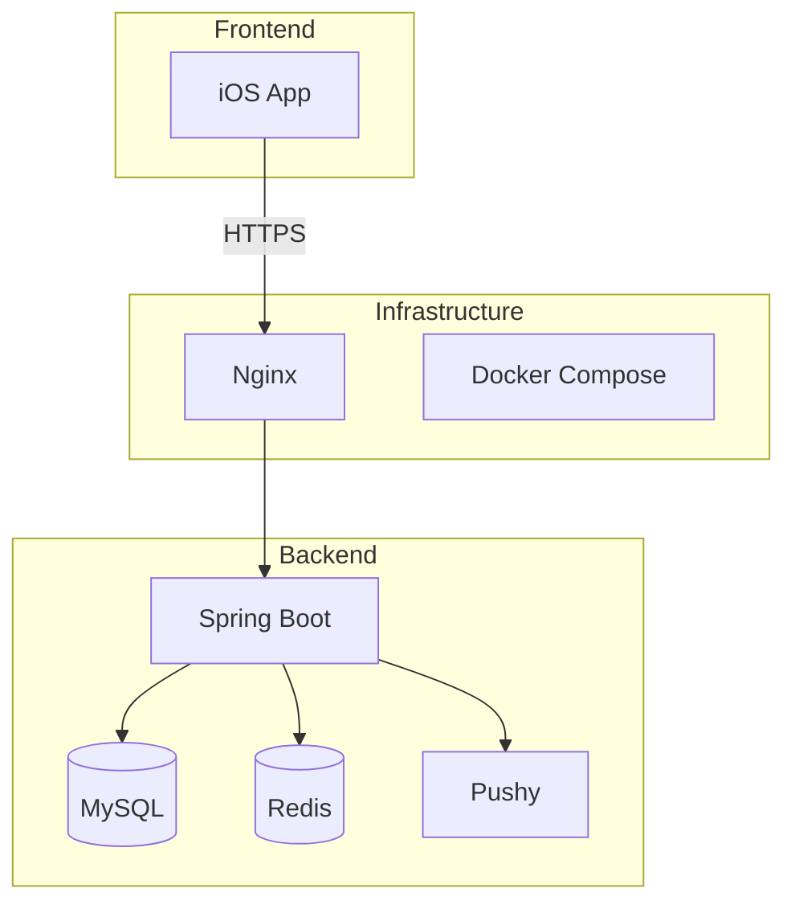
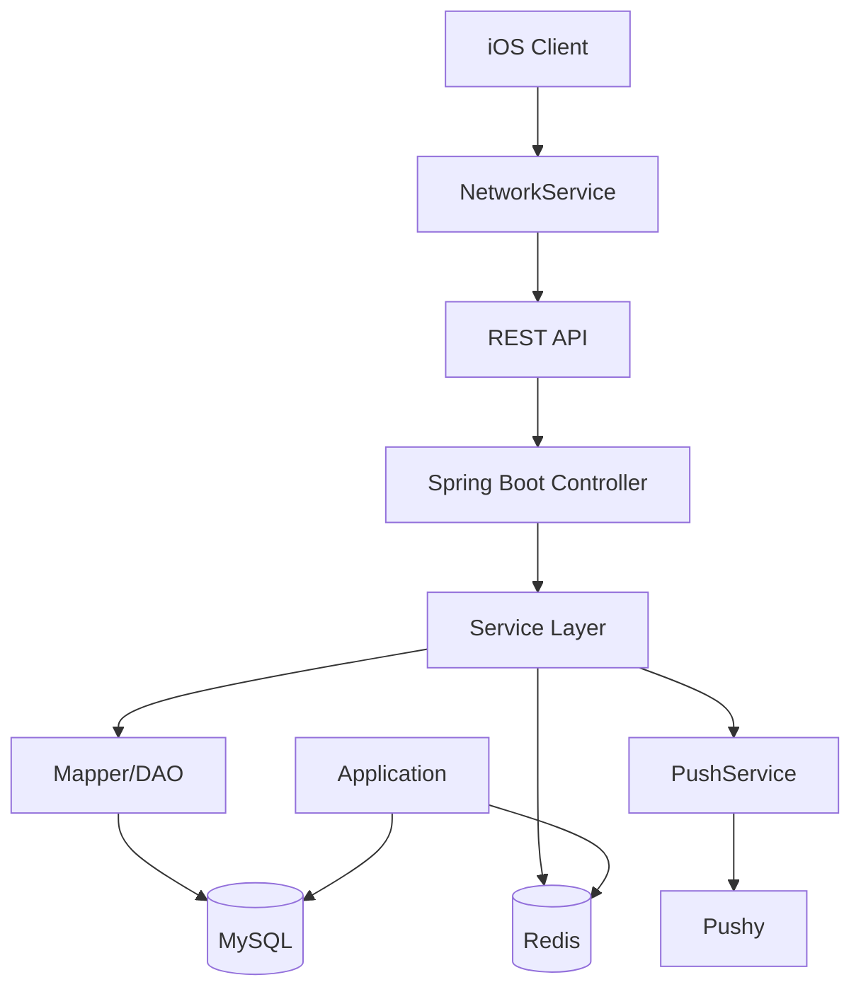
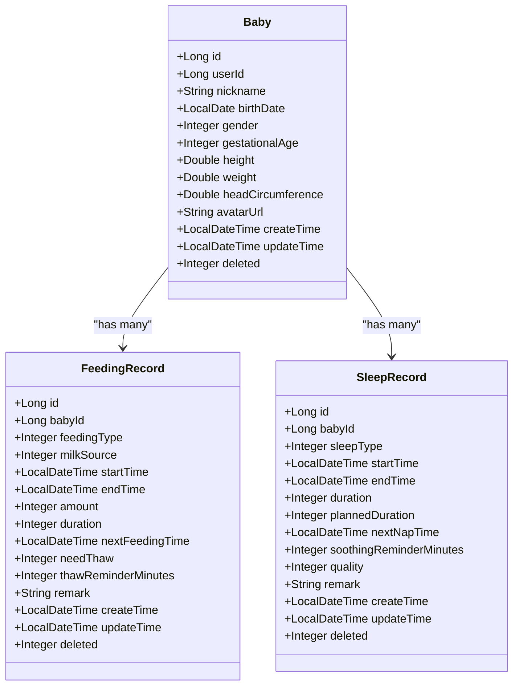
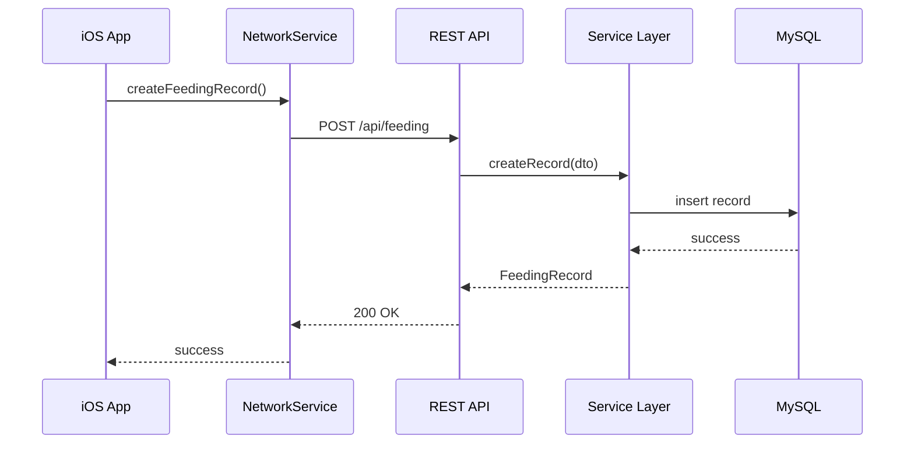
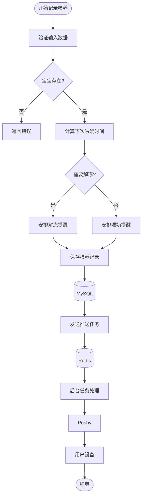
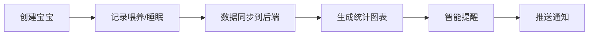
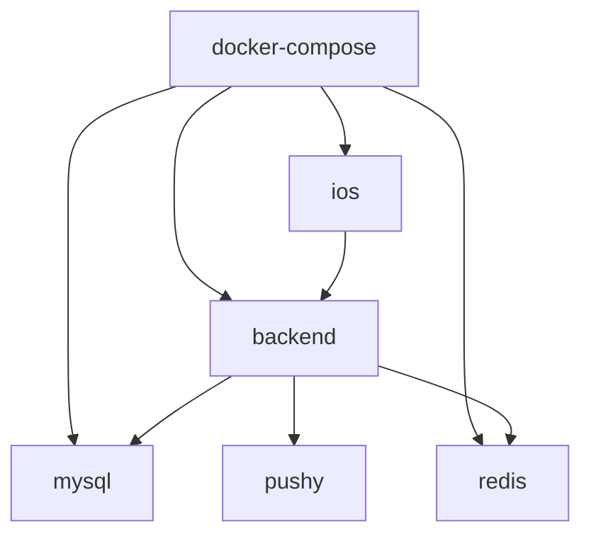

# 系统概述

<cite>
**Referenced Files in This Document**   
- [Application.java](file://backend/src/main/java/com/baby/Application.java)
- [BabyFeedingReminderApp.swift](file://ios/BabyFeedingReminder/BabyFeedingReminderApp.swift)
- [application.yml](file://backend/src/main/resources/application.yml)
- [docker-compose.yml](file://docker-compose.yml)
- [BabyController.java](file://backend/src/main/java/com/baby/controller/BabyController.java)
- [FeedingRecordController.java](file://backend/src/main/java/com/baby/controller/FeedingRecordController.java)
- [SleepRecordController.java](file://backend/src/main/java/com/baby/controller/SleepRecordController.java)
- [StatisticsController.java](file://backend/src/main/java/com/baby/controller/StatisticsController.java)
- [PushService.java](file://backend/src/main/java/com/baby/service/PushService.java)
- [NetworkService.swift](file://ios/BabyFeedingReminder/Services/NetworkService.swift)
- [NotificationService.swift](file://ios/BabyFeedingReminder/Services/NotificationService.swift)
- [Baby.java](file://backend/src/main/java/com/baby/entity/Baby.java)
- [FeedingRecord.java](file://backend/src/main/java/com/baby/entity/FeedingRecord.java)
- [SleepRecord.java](file://backend/src/main/java/com/baby/entity/SleepRecord.java)
</cite>

## Table of Contents
1. [Introduction](#introduction)
2. [Project Structure](#project-structure)
3. [Core Components](#core-components)
4. [Architecture Overview](#architecture-overview)
5. [Detailed Component Analysis](#detailed-component-analysis)
6. [Dependency Analysis](#dependency-analysis)
7. [Performance Considerations](#performance-considerations)
8. [Troubleshooting Guide](#troubleshooting-guide)
9. [Conclusion](#conclusion)

## Introduction
宝宝喂养提醒是一款基于国家卫健委官方指南的全栈式婴幼儿护理应用，旨在帮助父母科学管理婴儿的喂养与睡眠。系统采用iOS前端与Spring Boot后端架构，结合MySQL持久化存储、Redis缓存调度及Pushy推送服务，实现喂养记录、睡眠跟踪、统计分析与智能提醒等核心功能。本系统严格遵循中国婴幼儿健康标准，为用户提供符合国情的专业育儿指导。

## Project Structure
项目采用前后端分离架构，包含iOS客户端、Spring Boot服务端、MySQL数据库、Redis缓存及Nginx反向代理。后端使用Maven构建，前端基于Xcode项目组织，通过Docker Compose实现容器化部署。

**Diagram sources**
- [docker-compose.yml](file://docker-compose.yml#L3-L89)

**Section sources**
- [docker-compose.yml](file://docker-compose.yml#L1-L89)

## Core Components
系统核心组件包括宝宝信息管理、喂养记录、睡眠记录、统计分析与智能提醒五大模块。各组件通过RESTful API交互，数据模型映射清晰，业务逻辑分层明确。系统基于宝宝月龄自动匹配国家卫健委发布的喂养与睡眠指南，提供个性化建议。

**Section sources**
- [BabyController.java](file://backend/src/main/java/com/baby/controller/BabyController.java#L1-L80)
- [FeedingRecordController.java](file://backend/src/main/java/com/baby/controller/FeedingRecordController.java#L1-L112)
- [SleepRecordController.java](file://backend/src/main/java/com/baby/controller/SleepRecordController.java#L1-L139)
- [StatisticsController.java](file://backend/src/main/java/com/baby/controller/StatisticsController.java#L1-L149)

## Architecture Overview
系统采用典型的分层架构：iOS前端使用SwiftUI实现MVVM模式，后端基于Spring Boot提供REST API，MyBatis Plus操作MySQL数据库，Redis支持缓存与定时任务，Pushy实现APNs推送。配置文件中预置了国家卫健委的喂养与睡眠标准参数。

**Diagram sources**
- [Application.java](file://backend/src/main/java/com/baby/Application.java#L1-L17)
- [BabyFeedingReminderApp.swift](file://ios/BabyFeedingReminder/BabyFeedingReminderApp.swift#L1-L164)
- [NetworkService.swift](file://ios/BabyFeedingReminder/Services/NetworkService.swift#L1-L199)

## Detailed Component Analysis

### Component A Analysis
系统通过`Baby`、`FeedingRecord`、`SleepRecord`三个核心实体类管理婴儿数据。`Baby`实体包含出生日期、性别等基本信息；`FeedingRecord`记录喂养类型、奶量、时长等；`SleepRecord`跟踪睡眠类型、起止时间、质量评价。控制器层提供完整的CRUD接口，服务层集成业务规则与国家指南推荐值计算。

#### For Object-Oriented Components:

**Diagram sources**
- [Baby.java](file://backend/src/main/java/com/baby/entity/Baby.java#L1-L72)
- [FeedingRecord.java](file://backend/src/main/java/com/baby/entity/FeedingRecord.java#L1-L81)
- [SleepRecord.java](file://backend/src/main/java/com/baby/entity/SleepRecord.java#L1-L76)

#### For API/Service Components:

**Diagram sources**
- [FeedingRecordController.java](file://backend/src/main/java/com/baby/controller/FeedingRecordController.java#L33-L38)
- [NetworkService.swift](file://ios/BabyFeedingReminder/Services/NetworkService.swift#L89-L138)

#### For Complex Logic Components:

**Diagram sources**
- [FeedingRecordController.java](file://backend/src/main/java/com/baby/controller/FeedingRecordController.java#L33-L38)
- [PushService.java](file://backend/src/main/java/com/baby/service/PushService.java#L1-L23)

**Section sources**
- [FeedingRecordController.java](file://backend/src/main/java/com/baby/controller/FeedingRecordController.java#L1-L112)
- [FeedingRecord.java](file://backend/src/main/java/com/baby/entity/FeedingRecord.java#L1-L81)

### Conceptual Overview
用户创建宝宝档案后，可记录每次喂养与睡眠。系统根据宝宝月龄自动匹配国家卫健委指南，推荐合理奶量与睡眠时长。通过统计分析页面，家长可查看日均奶量、睡眠趋势等数据。智能提醒功能基于历史记录预测下次喂养/睡眠时间，并通过本地通知与APNs推送提醒。

## Dependency Analysis
系统依赖关系清晰，前端依赖后端API，后端依赖数据库与缓存。通过Maven管理Java依赖，CocoaPods（未显示）管理iOS依赖。Docker Compose编排服务依赖，确保启动顺序正确。

**Diagram sources**
- [docker-compose.yml](file://docker-compose.yml#L3-L89)

**Section sources**
- [docker-compose.yml](file://docker-compose.yml#L1-L89)

## Performance Considerations
系统通过Redis缓存高频访问数据（如宝宝信息、设置参数），减少数据库压力。API接口采用分页与范围查询，避免大数据量传输。iOS端使用Combine响应式编程优化UI更新性能。后台任务异步处理推送，保证主线程流畅。

## Troubleshooting Guide
常见问题包括网络连接失败、推送未收到、数据不同步等。检查后端服务是否正常运行（8080端口），数据库连接配置是否正确，Redis是否启动，APNs证书是否配置。iOS端需确认通知权限已开启，NetworkService中baseURL配置正确。

**Section sources**
- [NetworkService.swift](file://ios/BabyFeedingReminder/Services/NetworkService.swift#L33-L44)
- [application.yml](file://backend/src/main/resources/application.yml#L1-L98)

## Conclusion
宝宝喂养提醒系统架构合理，功能完整，紧密结合中国婴幼儿健康标准。前后端分离设计便于维护与扩展，数据驱动的智能提醒为家长提供科学育儿支持。未来可增加多宝宝支持、数据导出、成长曲线等功能。