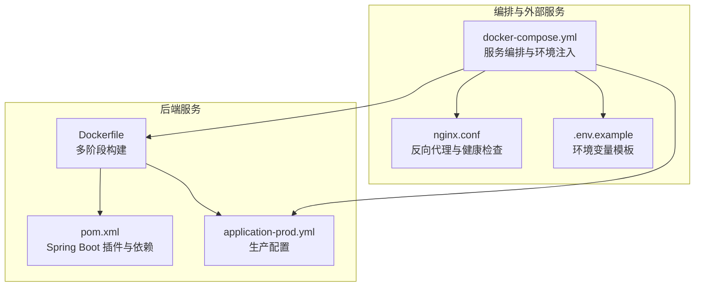
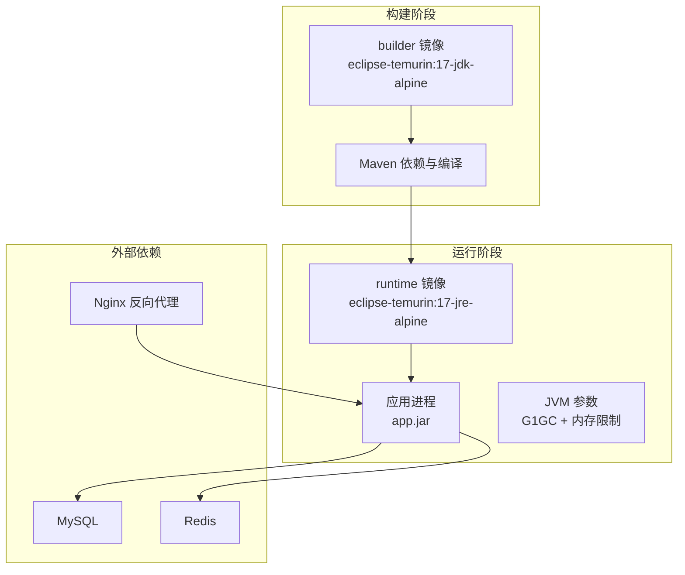
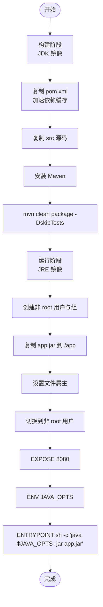
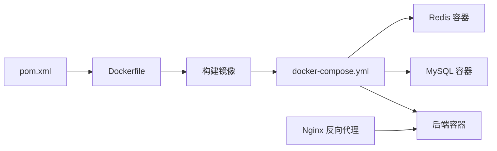

# Docker配置

<cite>
**本文引用的文件**
- [backend/Dockerfile](file://backend/Dockerfile)
- [backend/pom.xml](file://backend/pom.xml)
- [docker-compose.yml](file://docker-compose.yml)
- [backend/src/main/resources/application-prod.yml](file://backend/src/main/resources/application-prod.yml)
- [backend/start-dev.sh](file://backend/start-dev.sh)
- [nginx/nginx.conf](file://nginx/nginx.conf)
- [.env.example](file://.env.example)
</cite>

## 目录
1. [简介](#简介)
2. [项目结构](#项目结构)
3. [核心组件](#核心组件)
4. [架构总览](#架构总览)
5. [详细组件分析](#详细组件分析)
6. [依赖关系分析](#依赖关系分析)
7. [性能考量](#性能考量)
8. [故障排查指南](#故障排查指南)
9. [结论](#结论)
10. [附录](#附录)

## 简介
本文件面向 babyFeedingReminder 应用的 Spring Boot 后端服务，系统化梳理其 Docker 配置与多阶段构建策略。文档重点覆盖：
- 多阶段构建：使用 Eclipse Temurin 17 JDK 进行编译、Alpine 基础镜像、JRE 运行时以减小镜像体积
- 工作目录与依赖解析：WORKDIR、Maven 依赖缓存与源码复制、跳过测试打包
- 安全加固：非 root 用户运行、文件属主管理
- 运行参数：端口暴露、JVM 参数（G1GC、内存范围）、通过 shell 注入环境变量
- 生产就绪：健康检查、资源约束建议、网络与卷配置

## 项目结构
后端服务的容器化由 Dockerfile、Maven 构建配置与 docker-compose 编排共同构成；同时提供 Nginx 反向代理与环境变量示例。

图表来源
- [backend/Dockerfile](file://backend/Dockerfile#L1-L38)
- [backend/pom.xml](file://backend/pom.xml#L1-L135)
- [docker-compose.yml](file://docker-compose.yml#L1-L89)
- [backend/src/main/resources/application-prod.yml](file://backend/src/main/resources/application-prod.yml#L1-L85)
- [nginx/nginx.conf](file://nginx/nginx.conf#L53-L58)
- [.env.example](file://.env.example#L1-L13)

章节来源
- [backend/Dockerfile](file://backend/Dockerfile#L1-L38)
- [docker-compose.yml](file://docker-compose.yml#L1-L89)

## 核心组件
- 多阶段构建镜像
  - 构建阶段：基于 eclipse-temurin:17-jdk-alpine，设置工作目录，复制 pom.xml 与源码，安装 Maven 并执行打包（跳过测试），生成可执行 jar。
  - 运行阶段：基于 eclipse-temurin:17-jre-alpine，设置工作目录，创建非 root 用户组与用户，复制构建产物至 app.jar，设置文件属主，切换为非 root 用户，暴露 8080 端口，设置 JVM 参数，通过 shell 执行 java $JAVA_OPTS -jar app.jar。
- Maven 配置
  - Spring Boot Maven 插件排除 Lombok，避免运行时携带注解处理器。
- 编排与运行
  - docker-compose 将后端映射到宿主机 8080，并注入数据库与 Redis 的连接信息；后端在生产配置中读取这些环境变量。
  - Nginx 提供反向代理与健康检查端点（/health）。
  - .env.example 提供敏感配置占位符。

章节来源
- [backend/Dockerfile](file://backend/Dockerfile#L1-L38)
- [backend/pom.xml](file://backend/pom.xml#L118-L133)
- [docker-compose.yml](file://docker-compose.yml#L1-L89)
- [backend/src/main/resources/application-prod.yml](file://backend/src/main/resources/application-prod.yml#L1-L85)
- [nginx/nginx.conf](file://nginx/nginx.conf#L53-L58)
- [.env.example](file://.env.example#L1-L13)

## 架构总览
下图展示后端服务从构建到运行的关键路径，以及与数据库、缓存和反向代理的关系。

图表来源
- [backend/Dockerfile](file://backend/Dockerfile#L1-L38)
- [docker-compose.yml](file://docker-compose.yml#L1-L89)

## 详细组件分析

### 多阶段构建流程
- 构建阶段
  - 基础镜像：eclipse-temurin:17-jdk-alpine
  - 工作目录：/app
  - 依赖与源码：先复制 pom.xml 以利用 Maven 依赖缓存，再复制 src 源码
  - 构建命令：安装 Maven 并执行打包（跳过测试）
- 运行阶段
  - 基础镜像：eclipse-temurin:17-jre-alpine
  - 工作目录：/app
  - 用户与权限：创建非 root 组与用户，复制产物并设置属主
  - 运行用户：切换为非 root 用户
  - 端口：EXPOSE 8080
  - JVM：通过 ENV 设置 JAVA_OPTS（初始堆、最大堆、G1GC、最大停顿时间）
  - 入口：ENTRYPOINT 使用 shell 执行 java $JAVA_OPTS -jar app.jar，实现将环境变量注入到 Java 进程

图表来源
- [backend/Dockerfile](file://backend/Dockerfile#L1-L38)

章节来源
- [backend/Dockerfile](file://backend/Dockerfile#L1-L38)

### Maven 与打包策略
- Spring Boot Maven 插件排除 Lombok，避免运行时携带注解处理器，减少运行时依赖。
- 打包命令跳过测试，缩短构建时间并降低镜像层大小。

章节来源
- [backend/pom.xml](file://backend/pom.xml#L118-L133)
- [backend/Dockerfile](file://backend/Dockerfile#L10-L12)

### 运行时安全与权限
- 非 root 用户：创建专用组与用户，避免以 root 身份运行应用。
- 文件属主：复制产物后统一设置属主，保证容器内文件权限正确。
- 切换用户：在 ENTRYPOINT 前切换为非 root 用户，降低攻击面。

章节来源
- [backend/Dockerfile](file://backend/Dockerfile#L19-L27)

### 端口与 JVM 参数
- 端口：EXPOSE 8080，docker-compose 将宿主机 8080 映射到容器 8080。
- JVM：通过 ENV 设置 JAVA_OPTS，包含初始堆、最大堆、启用 G1GC、最大停顿时间等参数；ENTRYPOINT 使用 shell 将 JAVA_OPTS 注入到 Java 进程。

章节来源
- [backend/Dockerfile](file://backend/Dockerfile#L30-L35)
- [backend/src/main/resources/application-prod.yml](file://backend/src/main/resources/application-prod.yml#L1-L10)
- [docker-compose.yml](file://docker-compose.yml#L10-L12)

### 配置注入与环境变量
- docker-compose 注入数据库与 Redis 的连接信息，后端在生产配置中通过占位符读取。
- .env.example 提供敏感配置占位符，便于在部署时替换。

章节来源
- [docker-compose.yml](file://docker-compose.yml#L12-L19)
- [backend/src/main/resources/application-prod.yml](file://backend/src/main/resources/application-prod.yml#L10-L26)
- [.env.example](file://.env.example#L1-L13)

### 反向代理与健康检查
- Nginx 提供 /health 端点返回 healthy，可用于外部健康探测或反向代理健康检查。
- docker-compose 中后端服务依赖 MySQL 健康状态，确保数据库可用后再启动后端。

章节来源
- [nginx/nginx.conf](file://nginx/nginx.conf#L53-L58)
- [docker-compose.yml](file://docker-compose.yml#L19-L26)

## 依赖关系分析
- Dockerfile 依赖 pom.xml 的 Spring Boot 插件配置与依赖声明，以生成可执行 jar。
- docker-compose 依赖 Dockerfile 构建出的镜像，并注入运行时环境变量。
- 后端运行时依赖 MySQL 与 Redis，docker-compose 通过健康检查与依赖条件保障服务可用性。
- Nginx 作为可选反向代理，与后端服务在同一网络中。

图表来源
- [backend/pom.xml](file://backend/pom.xml#L1-L135)
- [backend/Dockerfile](file://backend/Dockerfile#L1-L38)
- [docker-compose.yml](file://docker-compose.yml#L1-L89)

章节来源
- [backend/pom.xml](file://backend/pom.xml#L1-L135)
- [backend/Dockerfile](file://backend/Dockerfile#L1-L38)
- [docker-compose.yml](file://docker-compose.yml#L1-L89)

## 性能考量
- 镜像体积控制
  - 使用 Alpine 基础镜像，结合 JDK 构建阶段与 JRE 运行阶段，仅在最终镜像中保留运行时所需组件。
  - 跳过测试打包，减少构建时间与镜像层大小。
- 层缓存优化
  - 先复制 pom.xml 再复制源码，使 Maven 依赖缓存尽可能命中，提升重复构建速度。
- JVM 参数
  - G1GC 适合中小堆场景，配合较小的堆上限（如 256m-512m）可降低内存占用与 GC 开销。
  - 最大停顿时间参数有助于平衡吞吐与延迟。
- 网络与卷
  - 使用独立 bridge 网络隔离服务间通信。
  - 数据卷持久化 MySQL 与 Redis 数据，避免重启丢失。

章节来源
- [backend/Dockerfile](file://backend/Dockerfile#L6-L12)
- [backend/Dockerfile](file://backend/Dockerfile#L14-L23)
- [backend/Dockerfile](file://backend/Dockerfile#L33-L35)
- [docker-compose.yml](file://docker-compose.yml#L82-L89)

## 故障排查指南
- 启动失败（端口占用）
  - 检查宿主机 8080 是否被占用；docker-compose 已将容器 8080 映射到宿主机 8080。
- 数据库连接异常
  - 确认 docker-compose 中数据库环境变量与后端生产配置一致；确保 MySQL 健康检查通过后再启动后端。
- 权限问题
  - 确认非 root 用户与文件属主设置已生效；必要时重新构建镜像。
- 健康检查
  - 使用 Nginx 的 /health 端点验证反向代理健康状态；或直接访问后端健康端点（若启用 Actuator）。
- 开发环境启动
  - 如需本地开发，可参考 start-dev.sh 脚本进行本地依赖检查与数据库准备。

章节来源
- [docker-compose.yml](file://docker-compose.yml#L10-L12)
- [docker-compose.yml](file://docker-compose.yml#L19-L26)
- [backend/Dockerfile](file://backend/Dockerfile#L19-L27)
- [nginx/nginx.conf](file://nginx/nginx.conf#L53-L58)
- [backend/start-dev.sh](file://backend/start-dev.sh#L1-L89)

## 结论
该 Docker 配置采用多阶段构建与 Alpine 基础镜像，结合非 root 用户与最小运行时组件，有效降低了镜像体积与安全风险。通过 ENV 注入 JVM 参数与 docker-compose 的环境变量注入，实现了灵活的运行时配置。配合 Nginx 健康检查与数据库健康检查，整体具备较好的生产就绪能力。建议在生产环境中进一步完善资源限制、日志采集与监控告警策略。

## 附录
- 环境变量模板
  - 参考 .env.example 中的占位符，按需替换敏感配置。
- 开发与调试
  - start-dev.sh 提供本地开发环境的依赖检查与数据库准备流程，便于快速启动与调试。

章节来源
- [.env.example](file://.env.example#L1-L13)
- [backend/start-dev.sh](file://backend/start-dev.sh#L1-L89)