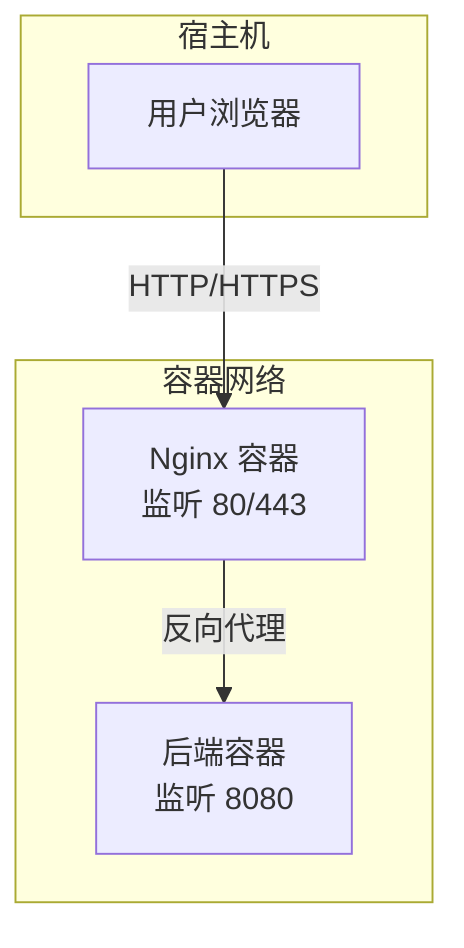
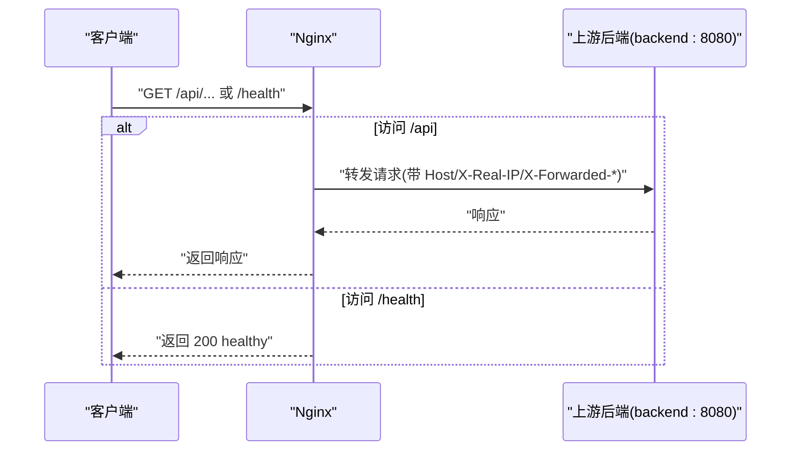
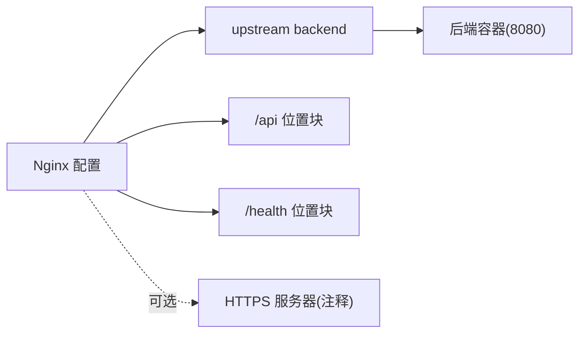
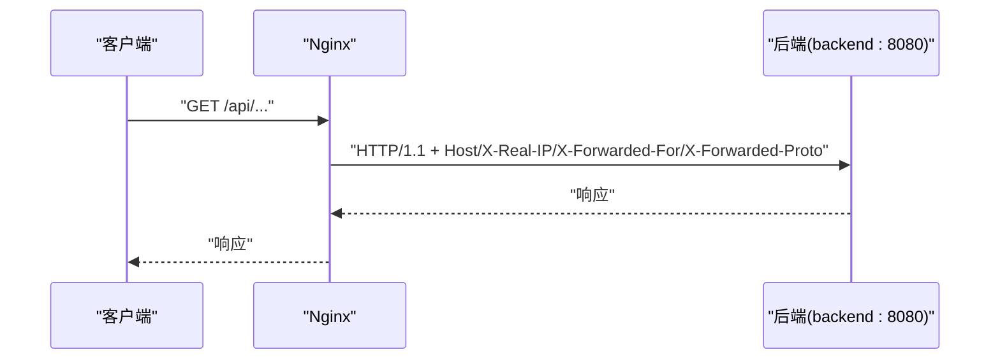
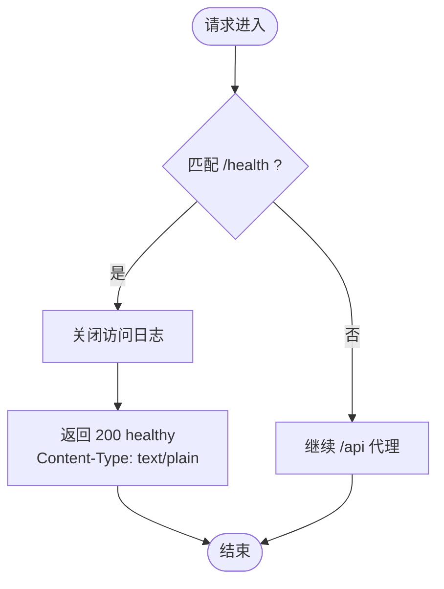

# Nginx反向代理

<cite>
**本文引用的文件**
- [nginx/nginx.conf](file://nginx/nginx.conf)
- [docker-compose.yml](file://docker-compose.yml)
- [backend/Dockerfile](file://backend/Dockerfile)
</cite>

## 目录
1. [简介](#简介)
2. [项目结构](#项目结构)
3. [核心组件](#核心组件)
4. [架构总览](#架构总览)
5. [详细组件分析](#详细组件分析)
6. [依赖关系分析](#依赖关系分析)
7. [性能考量](#性能考量)
8. [故障排查指南](#故障排查指南)
9. [结论](#结论)
10. [附录](#附录)

## 简介
本文件面向 babyFeedingReminder 应用的 Nginx 反向代理配置进行系统化架构文档说明。重点覆盖 nginx.conf 的事件块、HTTP 块、MIME 类型、Gzip 压缩、上游后端定义、HTTP 服务器监听与 /api 代理规则、/health 健康检查端点、日志格式与超时设置，以及生产环境 HTTPS 终止的注释配置与安全加固建议。文档同时结合 docker-compose 与后端镜像暴露端口，帮助读者理解容器网络与流量路径。

## 项目结构
该仓库将 Nginx 配置置于 nginx 目录，并通过 docker-compose 将其挂载到容器内。后端服务以 Java Spring Boot 应用运行在 8080 端口，Nginx 作为反向代理统一接入 80/443 端口，向上游 backend:8080 转发请求。

图表来源
- [docker-compose.yml](file://docker-compose.yml#L64-L81)
- [nginx/nginx.conf](file://nginx/nginx.conf#L30-L59)
- [backend/Dockerfile](file://backend/Dockerfile#L30-L31)

章节来源
- [docker-compose.yml](file://docker-compose.yml#L64-L81)
- [nginx/nginx.conf](file://nginx/nginx.conf#L30-L59)
- [backend/Dockerfile](file://backend/Dockerfile#L30-L31)

## 核心组件
- 事件块（events）：设置 worker_connections，控制每个工作进程的最大并发连接数。
- HTTP 块（http）：包含 MIME 类型、默认类型、文件传输、保活超时、日志格式、Gzip 压缩等全局配置。
- 上游（upstream backend）：定义后端服务地址 backend:8080，并启用 keepalive 以复用连接。
- HTTP 服务器（server）：监听 80，server_name 为 localhost；提供 /api 代理与 /health 健康检查。
- /api 位置块：代理到 upstream backend，转发关键头部，使用 HTTP/1.1 并设置超时。
- /health 位置块：返回纯文本“healthy”，状态码 200，关闭访问日志。
- 注释的 HTTPS 服务器：包含 TLS 1.2/1.3、证书路径、密码套件、会话缓存等生产级配置模板。

章节来源
- [nginx/nginx.conf](file://nginx/nginx.conf#L1-L79)

## 架构总览
下图展示从客户端到后端的完整请求链路，包括 Nginx 的代理与健康检查端点。

图表来源
- [nginx/nginx.conf](file://nginx/nginx.conf#L38-L59)
- [docker-compose.yml](file://docker-compose.yml#L64-L81)

## 详细组件分析

### 事件块（events）
- worker_connections：设置每个 worker 进程可处理的最大连接数，影响整体并发能力与资源占用。
- 影响范围：影响 Nginx 在高并发场景下的吞吐与稳定性。

章节来源
- [nginx/nginx.conf](file://nginx/nginx.conf#L1-L3)

### HTTP 块（http）
- MIME 类型与默认类型：通过 include mime.types 与 default_type 提升静态资源识别与正确响应。
- 文件传输与保活：sendfile 开启提升传输效率；keepalive_timeout 控制长连接保活时间。
- 日志格式（main）：记录远端地址、用户、时间、请求、状态码、字节数、Referer、UA、X-Forwarded-For 等，便于审计与排障。
- Gzip 压缩：
  - gzip on：开启压缩。
  - gzip_vary on：向下游发送 Vary: Accept-Encoding。
  - gzip_min_length：仅对大于阈值的内容压缩。
  - gzip_proxied any：代理场景下也应用压缩。
  - gzip_types：针对常见文本/JSON/JS/CSS/XML 等内容类型启用压缩，减少带宽消耗。

章节来源
- [nginx/nginx.conf](file://nginx/nginx.conf#L5-L23)

### 上游（upstream backend）
- 定义后端服务地址 backend:8080，与 docker-compose 中后端容器名称一致。
- keepalive 32：启用与后端的持久连接池，降低握手开销，提高吞吐。

章节来源
- [nginx/nginx.conf](file://nginx/nginx.conf#L24-L28)
- [docker-compose.yml](file://docker-compose.yml#L5-L26)

### HTTP 服务器（server）
- 监听 80，server_name localhost。
- /api 位置块：
  - proxy_pass 指向 upstream backend。
  - proxy_http_version 1.1：使用 HTTP/1.1，配合 Connection 头部。
  - 关键头部转发：
    - Host：保留原始主机名。
    - X-Real-IP：传递真实客户端 IP。
    - X-Forwarded-For：累积转发链路中的客户端 IP。
    - X-Forwarded-Proto：传递原始协议（http/https）。
  - Connection 置空：与 HTTP/1.1 协议配合，避免不必要的连接复用问题。
  - 超时设置：proxy_connect_timeout、proxy_send_timeout、proxy_read_timeout 均为 60s，保障长时间请求的稳定性。
- /health 位置块：
  - access_log off：关闭访问日志，减少 I/O。
  - return 200 "healthy\n"：返回纯文本健康状态。
  - add_header Content-Type text/plain：明确响应类型。

章节来源
- [nginx/nginx.conf](file://nginx/nginx.conf#L30-L59)

### HTTPS 服务器（注释模板）
- 注释了 HTTPS 监听 443、TLS 1.2/1.3、证书路径、密码套件、会话缓存等生产级配置，便于后续启用。
- 建议在启用前完成证书管理与安全加固。

章节来源
- [nginx/nginx.conf](file://nginx/nginx.conf#L61-L78)

### 容器网络与端口映射
- docker-compose 中：
  - Nginx 映射 80/443 到宿主。
  - 后端容器暴露 8080，Nginx 通过 upstream backend:8080 访问。
  - Nginx 依赖后端服务启动。
- 后端镜像 Dockerfile 显式 EXPOSE 8080，确保容器网络可达。

章节来源
- [docker-compose.yml](file://docker-compose.yml#L64-L81)
- [backend/Dockerfile](file://backend/Dockerfile#L30-L31)

## 依赖关系分析
- Nginx 依赖后端容器名称 backend 与端口 8080。
- /api 位置块依赖 upstream backend 的 keepalive 配置。
- /health 独立于上游，仅用于容器编排健康检查。
- HTTPS 服务器为可选扩展，需配合证书与安全配置启用。

图表来源
- [nginx/nginx.conf](file://nginx/nginx.conf#L24-L59)
- [docker-compose.yml](file://docker-compose.yml#L64-L81)

章节来源
- [nginx/nginx.conf](file://nginx/nginx.conf#L24-L59)
- [docker-compose.yml](file://docker-compose.yml#L64-L81)

## 性能考量
- 连接复用：upstream keepalive 与 HTTP/1.1 有助于降低握手成本，提升吞吐。
- 压缩策略：针对 JSON/JS/CSS/XML 等内容类型启用 Gzip，结合 gzip_min_length 阈值，平衡 CPU 与带宽。
- 超时设置：统一的 60s 超时可避免长时间连接占用资源，适合长轮询或大文件场景。
- 日志开销：/health 关闭访问日志，减少 I/O；main 日志格式便于集中化收集与分析。

章节来源
- [nginx/nginx.conf](file://nginx/nginx.conf#L17-L23)
- [nginx/nginx.conf](file://nginx/nginx.conf#L24-L28)
- [nginx/nginx.conf](file://nginx/nginx.conf#L38-L59)

## 故障排查指南
- 无法访问 /api
  - 检查 upstream backend 是否解析为后端容器名称，确认后端容器已启动且监听 8080。
  - 查看 Nginx 错误日志定位连接失败原因。
- /health 返回异常
  - 确认 /health 位置块未被其他规则覆盖，且容器网络连通。
- 响应缓慢
  - 检查 gzip 配置与内容类型是否命中；评估 keepalive 数量与 worker_connections。
  - 核对超时设置是否过短导致请求中断。
- HTTPS 启用后访问异常
  - 检查证书路径、权限与密码套件兼容性；确认域名与 server_name 匹配。

章节来源
- [nginx/nginx.conf](file://nginx/nginx.conf#L24-L59)
- [docker-compose.yml](file://docker-compose.yml#L64-L81)

## 结论
该 Nginx 配置以简洁清晰的方式实现了反向代理、健康检查与基础性能优化。通过 keepalive、Gzip 与统一超时设置，可在开发与生产环境中提供稳定高效的入口层。HTTPS 终止采用注释模板，便于按需启用并结合证书管理与安全加固策略落地。

## 附录

### /api 代理调用序列

图表来源
- [nginx/nginx.conf](file://nginx/nginx.conf#L38-L51)

### /health 健康检查流程

图表来源
- [nginx/nginx.conf](file://nginx/nginx.conf#L53-L58)

### HTTPS 启用与安全加固指引
- 启用步骤
  - 解除注释 HTTPS 服务器块，配置监听 443、TLS 版本、证书与密钥路径。
  - 在 location /api 中保持与 HTTP 相同的代理头与超时设置。
- 证书管理
  - 使用自动化证书（如 ACME）或自签证书；确保证书链完整与私钥权限最小化。
- 安全加固
  - 限制 TLS 密码套件，优先前向保密（ECDHE）与现代套件。
  - 启用 HSTS（如需）、OCSP Stapling、Session Cache 与 Session Timeout。
  - 限制 HTTP 方法与来源（如需），并结合 WAF/限流策略。

章节来源
- [nginx/nginx.conf](file://nginx/nginx.conf#L61-L78)