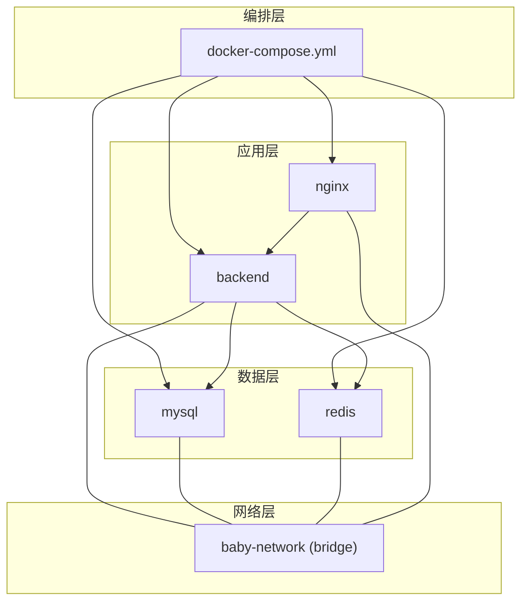
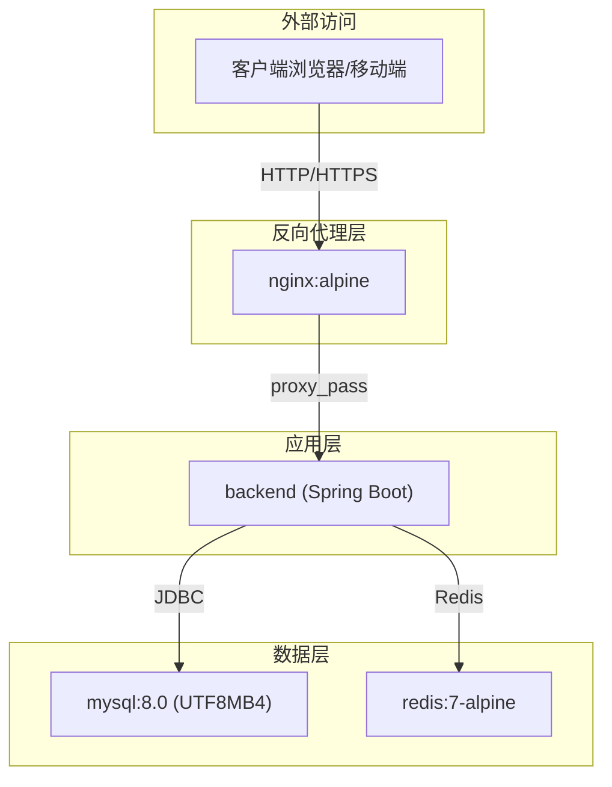
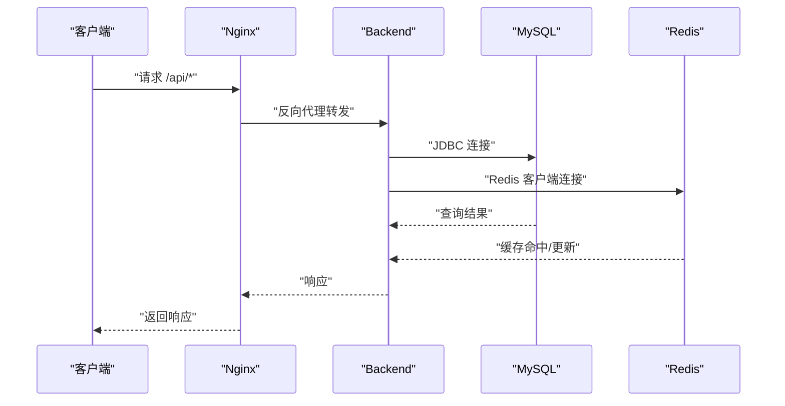
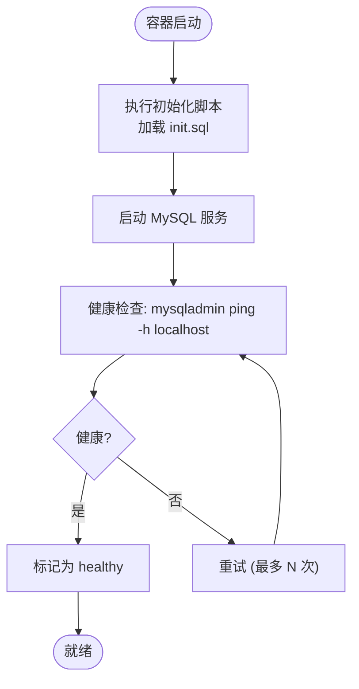
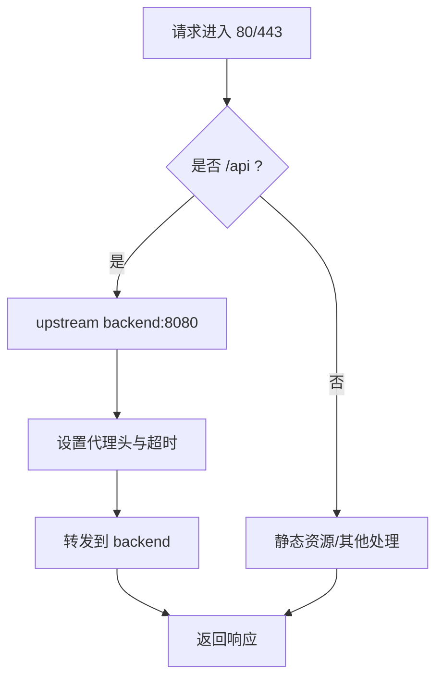
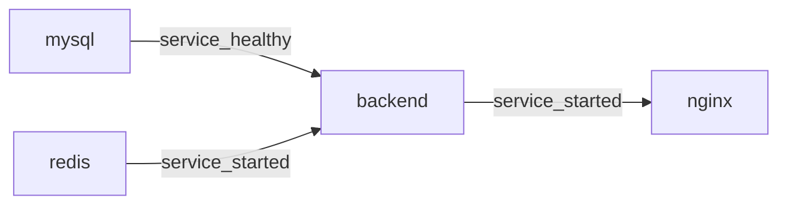

# docker-compose编排

<cite>
**本文引用的文件**
- [docker-compose.yml](file://docker-compose.yml)
- [.env.example](file://.env.example)
- [backend/Dockerfile](file://backend/Dockerfile)
- [backend/src/main/resources/application.yml](file://backend/src/main/resources/application.yml)
- [backend/src/main/resources/application-prod.yml](file://backend/src/main/resources/application-prod.yml)
- [nginx/nginx.conf](file://nginx/nginx.conf)
</cite>

## 目录
1. [简介](#简介)
2. [项目结构](#项目结构)
3. [核心组件](#核心组件)
4. [架构总览](#架构总览)
5. [详细组件分析](#详细组件分析)
6. [依赖关系分析](#依赖关系分析)
7. [性能考量](#性能考量)
8. [故障排查指南](#故障排查指南)
9. [结论](#结论)
10. [附录](#附录)

## 简介
本文件面向 babyFeedingReminder 应用的 docker-compose 编排，系统性说明版本 3.8 规范、四容器拓扑（后端、MySQL、Redis、Nginx）、自定义桥接网络 baby-network 的安全通信、各服务的构建与镜像来源、环境变量注入与外部化密钥、健康检查与启动顺序、端口映射与内部服务发现、重启策略与持久化卷、以及生产环境下的 Nginx 条件激活。同时给出可扩展建议，包括负载均衡与集群能力的演进方向。

## 项目结构
该编排采用单 Compose 文件集中管理后端、数据库、缓存与反向代理四个服务，并通过自定义桥接网络实现服务间隔离与互通；后端服务通过环境变量与外部 .env 文件进行配置注入；数据库与缓存分别挂载命名卷以持久化数据；Nginx 在生产配置文件中按需启用。

图表来源
- [docker-compose.yml](file://docker-compose.yml#L1-L89)

章节来源
- [docker-compose.yml](file://docker-compose.yml#L1-L89)

## 核心组件
- 后端服务（backend）
  - 构建上下文：./backend，Dockerfile 指定为 Dockerfile
  - 端口映射：8080:8080（容器内应用端口）
  - 环境变量：
    - SPRING_PROFILES_ACTIVE=prod
    - 数据源连接：指向 mysql:3306，字符集与时区配置
    - Redis 连接：指向 redis:6379
  - 依赖关系：先等待 mysql 健康，再等待 redis 启动
  - 网络：加入 baby-network
  - 重启策略：unless-stopped
- MySQL 服务（mysql）
  - 镜像：mysql:8.0
  - 端口映射：3307:3306（避免与宿主本地 MySQL 冲突）
  - 初始化命令：utf8mb4 字符集与排序规则初始化
  - 环境变量：根密码、数据库名、字符集、语言等
  - 卷：mysql_data 持久化数据；init.sql 初始化脚本挂载
  - 健康检查：mysqladmin ping -h localhost
  - 网络：加入 baby-network
  - 重启策略：unless-stopped
- Redis 服务（redis）
  - 镜像：redis:7-alpine
  - 端口映射：6379:6379
  - 卷：redis_data 持久化
  - 网络：加入 baby-network
  - 重启策略：unless-stopped
- Nginx 服务（nginx）
  - 镜像：nginx:alpine
  - 端口映射：80:80、443:443
  - 卷：挂载 nginx.conf 与 SSL 证书目录
  - 依赖关系：依赖 backend 启动
  - 网络：加入 baby-network
  - 重启策略：unless-stopped
  - 配置文件：profiles: production（仅在生产配置文件中启用）

章节来源
- [docker-compose.yml](file://docker-compose.yml#L1-L89)
- [backend/Dockerfile](file://backend/Dockerfile#L1-L38)
- [nginx/nginx.conf](file://nginx/nginx.conf#L1-L79)

## 架构总览
下图展示四容器拓扑与网络交互：Nginx 作为反向代理将 /api 请求转发至 backend；backend 通过 JDBC 访问 mysql，通过 Redis 客户端访问 redis；所有服务位于同一自定义桥接网络，实现安全隔离与内部 DNS 发现。

图表来源
- [docker-compose.yml](file://docker-compose.yml#L1-L89)
- [nginx/nginx.conf](file://nginx/nginx.conf#L1-L79)

## 详细组件分析

### 后端服务（backend）
- 构建与运行
  - 使用多阶段构建：builder 阶段使用 JDK 打包，运行阶段使用 JRE，降低镜像体积
  - 非 root 用户运行，提升安全性
  - JVM 参数优化，限制堆大小与 GC 策略
  - 暴露端口 8080，容器内应用端口与 Compose 映射一致
- 配置注入
  - 通过 SPRING_PROFILES_ACTIVE=prod 切换生产配置
  - 数据源 URL、用户名、密码由 compose 注入，支持 .env 变量回退
  - Redis 连接信息通过环境变量注入
- 依赖与健康
  - 依赖 mysql 健康后再启动，依赖 redis 启动后继续
  - 通过 depends_on + healthcheck 实现有序启动
- 网络与持久化
  - 加入 baby-network，内部通过服务名访问
  - 重启策略 unless-stopped，保证服务可用性

图表来源
- [docker-compose.yml](file://docker-compose.yml#L1-L89)
- [nginx/nginx.conf](file://nginx/nginx.conf#L1-L79)

章节来源
- [docker-compose.yml](file://docker-compose.yml#L1-L89)
- [backend/Dockerfile](file://backend/Dockerfile#L1-L38)
- [backend/src/main/resources/application-prod.yml](file://backend/src/main/resources/application-prod.yml#L1-L85)

### MySQL 服务（mysql）
- 版本与字符集
  - 使用官方 mysql:8.0 镜像
  - 初始化命令设置 utf8mb4 与排序规则，确保 emoji 与多字节字符支持
- 安全与持久化
  - 根密码从 .env 注入，支持回退默认值
  - 数据目录持久化至 mysql_data
  - 初始化 SQL 脚本挂载到 /docker-entrypoint-initdb.d
- 健康检查
  - 使用 mysqladmin ping -h localhost，超时与重试次数合理配置
  - 通过 depends_on condition: service_healthy 控制后端启动时机

图表来源
- [docker-compose.yml](file://docker-compose.yml#L1-L89)

章节来源
- [docker-compose.yml](file://docker-compose.yml#L1-L89)

### Redis 服务（redis）
- 镜像与特性
  - 使用 redis:7-alpine，轻量且适合容器化
  - 持久化卷 redis_data，保障数据不丢失
- 连接与使用
  - 默认端口 6379，后端通过环境变量注入主机与端口
  - 重启策略 unless-stopped，保证缓存可用性

章节来源
- [docker-compose.yml](file://docker-compose.yml#L1-L89)

### Nginx 服务（nginx）
- 配置与功能
  - 使用 nginx:alpine，挂载自定义 nginx.conf 与 SSL 目录
  - upstream 指向 backend:8080，开启 keepalive
  - /api 路径代理到后端，设置常见头与超时
  - 提供 /health 健康检查页面
- 生产条件
  - 通过 profiles: production 仅在生产配置文件中启用
  - 支持 HTTPS 服务器块注释模板（可按需启用）

图表来源
- [nginx/nginx.conf](file://nginx/nginx.conf#L1-L79)
- [docker-compose.yml](file://docker-compose.yml#L1-L89)

章节来源
- [nginx/nginx.conf](file://nginx/nginx.conf#L1-L79)
- [docker-compose.yml](file://docker-compose.yml#L1-L89)

## 依赖关系分析
- 服务依赖
  - backend 依赖 mysql 健康与 redis 启动
  - nginx 依赖 backend 启动
- 网络依赖
  - 所有服务加入 baby-network，内部通过服务名相互发现
- 环境变量与外部化
  - MYSQL_ROOT_PASSWORD 优先取自 .env，compose 中提供回退值
  - JWT_SECRET、APNs 等敏感配置来自 .env，后端生产配置文件中以占位符形式注入
- 健康检查与启动顺序
  - mysql 的健康检查确保后端连接前数据库已就绪
  - redis 启动即视为可用，后端可直接连接

图表来源
- [docker-compose.yml](file://docker-compose.yml#L1-L89)

章节来源
- [docker-compose.yml](file://docker-compose.yml#L1-L89)

## 性能考量
- 后端 JVM 参数已优化，建议结合实际负载调整最大堆与 GC 参数
- Nginx 已启用 gzip 与 keepalive，可进一步根据并发场景调优 worker_connections 与上游 keepalive 数
- 数据库连接池与 Redis 连接池在生产配置中已设定上限，建议根据 QPS 与延迟目标微调
- 建议引入连接池监控与慢查询日志，定位瓶颈

[本节为通用指导，无需列出具体文件来源]

## 故障排查指南
- 后端无法连接数据库
  - 检查 mysql 健康状态与日志
  - 确认 SPRING_DATASOURCE_URL、用户名、密码正确
  - 排查网络连通性（服务名解析）
- Redis 连接失败
  - 检查 redis 是否正常启动与持久化卷挂载
  - 确认后端 Redis 主机与端口配置
- Nginx 代理异常
  - 查看 nginx.conf 的 /api 路由与 upstream 配置
  - 检查后端健康检查 /health 是否可达
- 端口冲突
  - 确认宿主机端口映射未被占用（8080、3307、6379、80、443）
- 环境变量缺失
  - 确认 .env 文件存在且包含 MYSQL_ROOT_PASSWORD、JWT_SECRET 等关键项

章节来源
- [docker-compose.yml](file://docker-compose.yml#L1-L89)
- [backend/src/main/resources/application-prod.yml](file://backend/src/main/resources/application-prod.yml#L1-L85)
- [.env.example](file://.env.example#L1-L13)

## 结论
该编排以 docker-compose.yml 为核心，构建了稳定可靠的四容器拓扑：后端、MySQL、Redis、Nginx，通过自定义桥接网络实现安全隔离与内部服务发现；借助健康检查与启动顺序控制，确保应用在生产环境下可靠启动；通过 .env 外部化密钥与生产配置文件，实现环境解耦与安全治理。当前架构满足单实例部署需求，若需横向扩展，可考虑引入负载均衡与数据库/缓存集群方案。

[本节为总结性内容，无需列出具体文件来源]

## 附录

### 端口映射与内部服务发现
- 外部访问端口
  - 8080:8080（后端）
  - 3307:3306（MySQL）
  - 6379:6379（Redis）
  - 80:80、443:443（Nginx）
- 内部服务发现
  - 后端通过 mysql、redis、backend 服务名访问
  - Nginx 通过 upstream backend:8080 访问后端

章节来源
- [docker-compose.yml](file://docker-compose.yml#L1-L89)

### 环境变量与外部化密钥
- 关键变量
  - MYSQL_ROOT_PASSWORD：数据库根密码，优先取自 .env
  - SPRING_PROFILES_ACTIVE：切换生产配置
  - SPRING_DATASOURCE_*：数据库连接信息
  - SPRING_DATA_REDIS_*：Redis 连接信息
  - JWT_SECRET：JWT 密钥
- .env 示例
  - 包含 MYSQL_ROOT_PASSWORD、JWT_SECRET、APNs 可选配置

章节来源
- [docker-compose.yml](file://docker-compose.yml#L1-L89)
- [.env.example](file://.env.example#L1-L13)
- [backend/src/main/resources/application-prod.yml](file://backend/src/main/resources/application-prod.yml#L1-L85)

### 可扩展性建议
- 负载均衡
  - 在 Nginx 前增加反向代理或使用云负载均衡器，将流量分发至多个后端实例
- 数据库高可用
  - 引入 MySQL 主从复制或集群（如 MySQL Group Replication），并配置只读副本
- 缓存高可用
  - 使用 Redis Sentinel 或 Redis Cluster，提升缓存可用性与扩展性
- 配置中心
  - 引入 Spring Cloud Config 或 Consul，集中管理配置与密钥
- 日志与监控
  - 统一收集后端、Nginx、数据库与缓存日志，接入指标监控与告警体系

[本节为通用指导，无需列出具体文件来源]