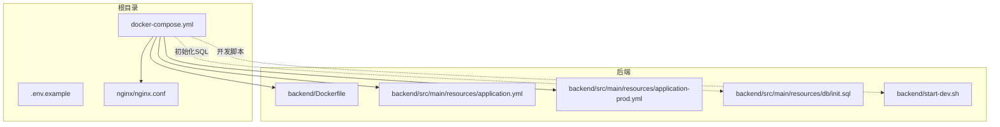
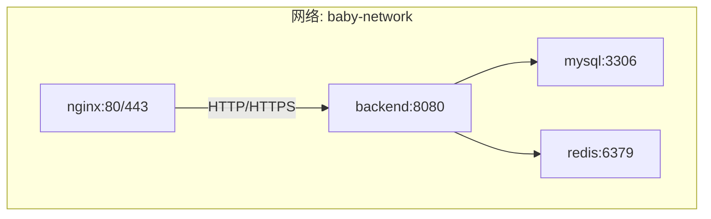
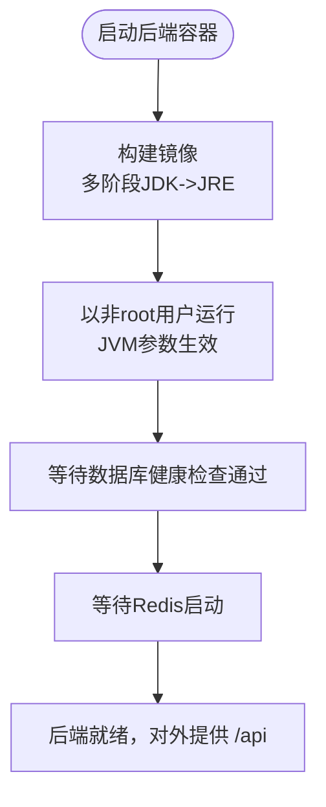
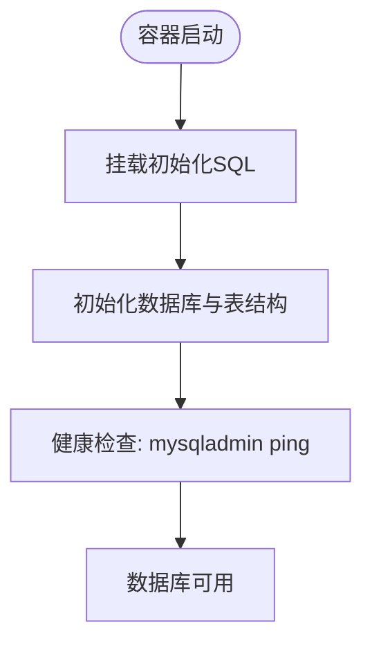
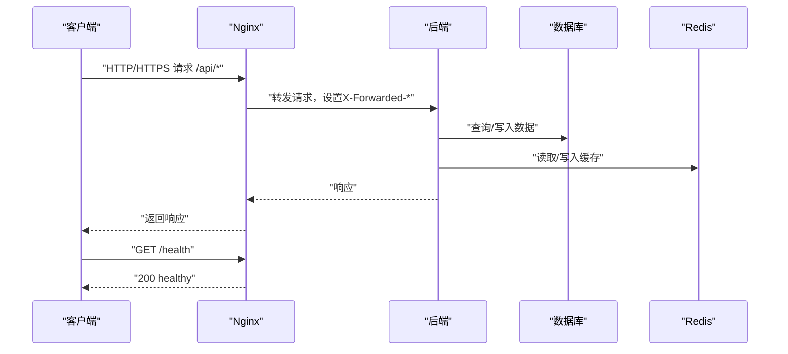
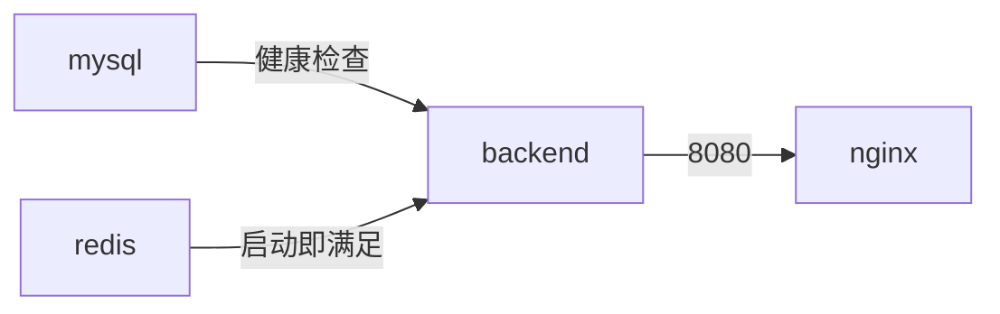

# 部署架构

<cite>
**本文引用的文件**
- [docker-compose.yml](file://docker-compose.yml)
- [Dockerfile](file://backend/Dockerfile)
- [nginx.conf](file://nginx/nginx.conf)
- [application.yml](file://backend/src/main/resources/application.yml)
- [application-prod.yml](file://backend/src/main/resources/application-prod.yml)
- [.env.example](file://.env.example)
- [init.sql](file://backend/src/main/resources/db/init.sql)
- [start-dev.sh](file://backend/start-dev.sh)
</cite>

## 目录
1. [简介](#简介)
2. [项目结构](#项目结构)
3. [核心组件](#核心组件)
4. [架构总览](#架构总览)
5. [详细组件分析](#详细组件分析)
6. [依赖关系分析](#依赖关系分析)
7. [性能与可扩展性](#性能与可扩展性)
8. [故障排查指南](#故障排查指南)
9. [结论](#结论)
10. [附录](#附录)

## 简介
本文件面向 babyFeedingReminder 应用的容器化部署基础设施，系统性说明后端 Spring Boot 的自定义镜像策略、数据库与缓存的官方镜像使用、以及通过 docker-compose 编排的服务编排与网络拓扑。文档还涵盖 Nginx 反向代理在 docker-compose 中的可选部署方式、路由规则与静态资源访问能力，并对生产环境的 HTTPS 终止配置进行注释说明。最后，给出基础设施要求、可扩展性建议、开发与生产两套配置的差异、服务发现与负载均衡潜力，以及零停机部署策略。

## 项目结构
该仓库采用“根目录编排 + 子模块”的组织方式：
- 根目录包含 docker-compose 编排文件、Nginx 配置与环境示例。
- backend 目录为 Spring Boot 后端工程，包含 Dockerfile、Spring 配置与初始化 SQL。
- ios 目录为 iOS 客户端工程，与部署架构无直接耦合。
- nginx 目录提供 Nginx 配置文件，供 docker-compose 挂载使用。

图表来源
- [docker-compose.yml](file://docker-compose.yml#L1-L89)
- [Dockerfile](file://backend/Dockerfile#L1-L38)
- [nginx.conf](file://nginx/nginx.conf#L1-L79)
- [application.yml](file://backend/src/main/resources/application.yml#L1-L98)
- [application-prod.yml](file://backend/src/main/resources/application-prod.yml#L1-L85)
- [init.sql](file://backend/src/main/resources/db/init.sql#L1-L147)
- [start-dev.sh](file://backend/start-dev.sh#L1-L89)

章节来源
- [docker-compose.yml](file://docker-compose.yml#L1-L89)
- [Dockerfile](file://backend/Dockerfile#L1-L38)
- [nginx.conf](file://nginx/nginx.conf#L1-L79)
- [application.yml](file://backend/src/main/resources/application.yml#L1-L98)
- [application-prod.yml](file://backend/src/main/resources/application-prod.yml#L1-L85)
- [.env.example](file://.env.example#L1-L13)
- [init.sql](file://backend/src/main/resources/db/init.sql#L1-L147)
- [start-dev.sh](file://backend/start-dev.sh#L1-L89)

## 核心组件
- 后端服务（Spring Boot）
  - 使用自定义 Dockerfile 构建多阶段镜像，运行阶段采用 JRE 并以非 root 用户运行，暴露 8080 端口，设置 JVM 参数。
  - 通过 docker-compose 以 prod 配置运行，依赖数据库与缓存服务。
- 数据库（MySQL 8.0）
  - 使用官方镜像，持久化数据卷，挂载初始化 SQL 文件，提供健康检查。
- 缓存（Redis 7-alpine）
  - 使用官方镜像，持久化数据卷，便于生产环境缓存与会话存储。
- 反向代理（Nginx alpine）
  - 可选生产部署，监听 80/443，将 /api 路由转发至后端，提供上游 keepalive 与超时控制；健康检查路径 /health。
- 配置与环境
  - 开发与生产配置分离，生产配置通过环境变量注入数据库连接、Redis 地址、日志与 Actuator 等。
  - .env.example 提供敏感参数占位符，便于本地与 CI 环境注入。

章节来源
- [Dockerfile](file://backend/Dockerfile#L1-L38)
- [docker-compose.yml](file://docker-compose.yml#L1-L89)
- [application.yml](file://backend/src/main/resources/application.yml#L1-L98)
- [application-prod.yml](file://backend/src/main/resources/application-prod.yml#L1-L85)
- [.env.example](file://.env.example#L1-L13)

## 架构总览
下图展示容器化部署的整体拓扑：后端服务依赖数据库与缓存，Nginx 作为可选反向代理统一入口，三者位于同一自定义桥接网络中，实现服务间 DNS 解析与隔离。

图表来源
- [docker-compose.yml](file://docker-compose.yml#L1-L89)
- [nginx.conf](file://nginx/nginx.conf#L1-L79)

## 详细组件分析

### 后端服务（Spring Boot）
- 容器化策略
  - 多阶段构建：构建阶段使用 JDK 打包，运行阶段仅包含 JRE，减小镜像体积并提升安全性。
  - 非 root 用户运行，降低权限风险。
  - JVM 参数在镜像层设置，便于统一调优。
- 运行与依赖
  - 通过 docker-compose 以 prod 配置启动，依赖数据库与缓存服务。
  - 依赖健康检查确保数据库可用后再启动后端。
- 配置要点
  - 生产配置通过环境变量注入数据库 URL、用户名、密码、Redis 地址与端口等。
  - Actuator 暴露健康、指标等端点，便于外部监控与探活。
  - 日志输出到文件，便于容器内采集。

图表来源
- [Dockerfile](file://backend/Dockerfile#L1-L38)
- [docker-compose.yml](file://docker-compose.yml#L1-L89)
- [application-prod.yml](file://backend/src/main/resources/application-prod.yml#L1-L85)

章节来源
- [Dockerfile](file://backend/Dockerfile#L1-L38)
- [docker-compose.yml](file://docker-compose.yml#L1-L89)
- [application-prod.yml](file://backend/src/main/resources/application-prod.yml#L1-L85)

### 数据库（MySQL 8.0）
- 镜像与持久化
  - 使用官方 MySQL 8.0 镜像，数据卷持久化，避免容器重建丢失数据。
- 初始化与字符集
  - 通过挂载初始化 SQL 文件创建数据库与表结构，并设置字符集与排序规则。
- 健康检查
  - 使用 ping 命令检测数据库可达性，设定超时与重试次数，保障依赖链稳定。
- 端口映射
  - 将容器 3306 映射到宿主 3307，避免与本地已有 MySQL 冲突。

图表来源
- [docker-compose.yml](file://docker-compose.yml#L1-L89)
- [init.sql](file://backend/src/main/resources/db/init.sql#L1-L147)

章节来源
- [docker-compose.yml](file://docker-compose.yml#L1-L89)
- [init.sql](file://backend/src/main/resources/db/init.sql#L1-L147)

### 缓存（Redis 7-alpine）
- 镜像与持久化
  - 使用官方 Redis 7-alpine 镜像，数据卷持久化，适合生产级缓存与会话存储。
- 端口映射
  - 将容器 6379 映射到宿主 6379，便于本地调试与运维工具接入。

章节来源
- [docker-compose.yml](file://docker-compose.yml#L1-L89)

### 反向代理（Nginx）
- 位置与作用
  - 在 docker-compose 中作为可选服务部署，监听 80/443，将 /api 路由转发至后端。
- 路由与头部
  - 对 /api 请求设置代理头部，包括 Host、X-Real-IP、X-Forwarded-* 等，便于后端识别真实客户端与协议。
- 健康检查
  - 提供 /health 返回 200，便于外部探活。
- HTTPS 终止（注释）
  - 提供 HTTPS 服务器块注释示例，包含证书路径与协议配置，便于生产环境启用 SSL 终止。

图表来源
- [nginx.conf](file://nginx/nginx.conf#L1-L79)
- [docker-compose.yml](file://docker-compose.yml#L1-L89)

章节来源
- [nginx.conf](file://nginx/nginx.conf#L1-L79)
- [docker-compose.yml](file://docker-compose.yml#L1-L89)

### 配置与环境管理
- 开发与生产配置
  - application.yml 适用于本地开发，默认连接本地数据库与缓存。
  - application-prod.yml 适用于容器化生产，通过环境变量注入数据库与缓存地址、日志与 Actuator 等。
- 环境变量
  - .env.example 提供敏感参数占位符，如数据库 root 密码、JWT 密钥、APNs 配置等，便于在 docker-compose 中注入。
- 初始化 SQL
  - init.sql 定义数据库、表与索引，以及初始测试用户，配合 docker-compose 的挂载实现首次初始化。

章节来源
- [application.yml](file://backend/src/main/resources/application.yml#L1-L98)
- [application-prod.yml](file://backend/src/main/resources/application-prod.yml#L1-L85)
- [.env.example](file://.env.example#L1-L13)
- [init.sql](file://backend/src/main/resources/db/init.sql#L1-L147)

### 开发环境辅助脚本
- start-dev.sh
  - 检测 Java 与 Maven，提示是否使用 Docker 启动数据库容器，最终以 dev 配置启动后端。
  - 与 docker-compose 的开发模式互补，便于本地快速验证。

章节来源
- [start-dev.sh](file://backend/start-dev.sh#L1-L89)

## 依赖关系分析
- 服务依赖
  - backend 依赖 mysql（健康检查通过）与 redis（启动即满足）。
  - nginx 依赖 backend（启动后满足）。
- 网络与命名
  - 所有服务位于自定义桥接网络 baby-network，彼此可通过服务名解析。
- 卷与持久化
  - mysql_data 与 redis_data 卷确保数据持久化。
- 重启策略
  - 所有服务均设置 unless-stopped，提升稳定性与自愈能力。

图表来源
- [docker-compose.yml](file://docker-compose.yml#L1-L89)

章节来源
- [docker-compose.yml](file://docker-compose.yml#L1-L89)

## 性能与可扩展性
- JVM 与 GC
  - 镜像层设置 JVM 参数，采用 G1 垂直，有助于降低 GC 暂停时间，适合容器内存受限场景。
- 连接池与缓存
  - 生产配置中数据库连接池与 Redis 连接池参数可按容量调整，建议结合压测结果迭代。
- 反向代理
  - Nginx 提供上游 keepalive 与超时控制，具备基础负载均衡能力；生产可横向扩展 Nginx 实例并通过外部 LB 或 Ingress 实现高可用。
- 数据库与缓存
  - 建议使用独立的高可用数据库与缓存集群，配合只读副本与连接池优化，满足并发增长需求。
- 零停机部署
  - 利用容器编排的滚动更新与健康检查，结合 Nginx 的平滑切换与后端的优雅关闭，实现零停机升级。

[本节为通用指导，不直接分析具体文件]

## 故障排查指南
- 后端无法启动
  - 检查数据库健康检查是否通过，确认 mysql 服务已就绪。
  - 查看后端容器日志，确认生产配置中的数据库与 Redis 地址是否正确注入。
- 数据库初始化失败
  - 确认 init.sql 已挂载且语法正确；检查卷权限与字符集设置。
- Nginx 代理异常
  - 检查 /api 路由是否正确转发至 backend:8080；确认代理头部是否完整。
  - 访问 /health 确认 Nginx 自身健康状态。
- 环境变量缺失
  - 确认 .env.example 中的关键变量已在 docker-compose 中注入，尤其是数据库 root 密码与 JWT 密钥。

章节来源
- [docker-compose.yml](file://docker-compose.yml#L1-L89)
- [application-prod.yml](file://backend/src/main/resources/application-prod.yml#L1-L85)
- [nginx.conf](file://nginx/nginx.conf#L1-L79)

## 结论
该部署架构以 docker-compose 为核心，结合自定义 Spring Boot 镜像与官方 MySQL、Redis、Nginx 镜像，形成清晰的开发与生产拓扑。通过环境变量注入与健康检查，实现了稳定的依赖管理与自愈能力。生产环境中可进一步引入外部负载均衡、数据库与缓存高可用方案，以及完善的 HTTPS 终止与监控告警体系，以支撑业务持续增长。

[本节为总结性内容，不直接分析具体文件]

## 附录

### 开发与生产配置对比
- 开发配置（application.yml）
  - 默认连接本地数据库与缓存，便于本地联调。
- 生产配置（application-prod.yml）
  - 通过环境变量注入数据库与缓存地址、日志与 Actuator 等，适配容器化运行。

章节来源
- [application.yml](file://backend/src/main/resources/application.yml#L1-L98)
- [application-prod.yml](file://backend/src/main/resources/application-prod.yml#L1-L85)

### 基础设施要求
- 容器运行时
  - 支持 Docker Engine 与 Compose v2 的环境。
- 系统资源
  - 后端 JVM 参数已设定最小/最大堆大小，建议根据并发与数据规模调整。
- 网络
  - 需要开放 8080（后端）、3307（MySQL 映射端口）、6379（Redis 映射端口），以及 80/443（Nginx，可选）。
- 存储
  - 为 mysql_data 与 redis_data 卷预留持久化空间。

章节来源
- [docker-compose.yml](file://docker-compose.yml#L1-L89)
- [Dockerfile](file://backend/Dockerfile#L1-L38)

### 部署拓扑与零停机策略
- 拓扑
  - 后端依赖数据库与缓存，Nginx 作为可选入口；服务间通过自定义网络通信。
- 零停机
  - 使用容器编排的滚动更新与健康检查，结合 Nginx 的平滑切换与后端优雅关闭，减少业务中断。

章节来源
- [docker-compose.yml](file://docker-compose.yml#L1-L89)
- [nginx.conf](file://nginx/nginx.conf#L1-L79)